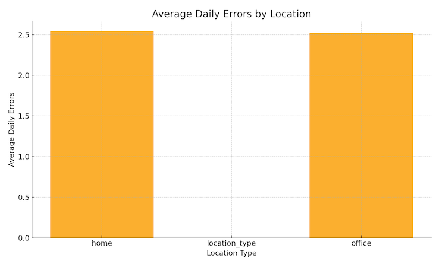

# iButler - Menuju v2

## Analisis v1

## 1. Pendahuluan

iButler telah merevolusi bantuan rumah dan kantor dengan menghadirkan robot pembantu humanoid ke pasar massal. Sebagai
asisten robot multi-guna pertama yang layak secara komersial, iButler v1 telah mengubah kehidupan sehari-hari ribuan
pelanggan sejak peluncurannya pada Januari 2024. Aspek ini menyoroti pentingnya pokok bahasan dalam konteks yang lebih
luas, menawarkan wawasan lebih dalam tentang bagaimana hal itu dapat diterapkan secara praktis dan konseptual.
Selanjutnya, ini memperkuat relevansi topik dengan menunjukkan perannya dalam aplikasi saat ini dan masa depan. Diskusi
ini membuka jalan bagi eksplorasi yang lebih menyeluruh tentang prinsip-prinsip yang mendasari hasil ini. Dalam banyak
hal, pengamatan tersebut berfungsi sebagai batu loncatan untuk penelitian masa depan dan investigasi yang lebih
mendalam.

**Pembersihan:**
Kemampuan pembersihan permukaan, penyedotan debu, dan sanitasi yang komprehensif.

**Memasak:**
Perencanaan menu, penyiapan bahan, dan penyiapan makanan lengkap.

**Binatu:**
Perawatan pakaian lengkap mulai dari memilah hingga mencuci, mengeringkan, dan melipat. Aspek ini menyoroti pentingnya
pokok bahasan dalam konteks yang lebih luas, menawarkan wawasan lebih dalam tentang bagaimana hal itu dapat diterapkan
secara praktis dan konseptual. Selanjutnya, ini memperkuat relevansi topik dengan menunjukkan perannya dalam aplikasi
saat ini dan masa depan. Diskusi ini membuka jalan bagi eksplorasi yang lebih menyeluruh tentang prinsip-prinsip yang
mendasari hasil ini. Dalam banyak hal, pengamatan tersebut berfungsi sebagai batu loncatan untuk penelitian masa depan
dan
investigasi yang lebih mendalam.

## 2. Fitur

### 2.1. Pembersihan

Kemampuan pembersihan iButler mencakup menyedot debu, mengepel, dan membersihkan permukaan. Dilengkapi dengan sensor
canggih
dan algoritma bertenaga AI, ia menavigasi rintangan secara efisien dan memastikan kebersihan menyeluruh di rumah dan
kantor. Aspek ini menyoroti pentingnya pokok bahasan dalam konteks yang lebih luas, menawarkan wawasan lebih dalam
tentang bagaimana hal itu dapat diterapkan secara praktis dan konseptual. Selanjutnya, ini memperkuat relevansi topik
dengan menunjukkan perannya dalam aplikasi saat ini dan masa depan. Diskusi ini membuka jalan bagi eksplorasi yang lebih
menyeluruh tentang prinsip-prinsip yang mendasari hasil ini. Dalam banyak hal, pengamatan tersebut berfungsi sebagai
batu
loncatan untuk penelitian masa depan dan investigasi yang lebih mendalam.

Robot ini menggunakan kombinasi navigasi berbasis LiDAR dan kamera untuk memetakan lingkungannya, memungkinkannya
mengoptimalkan jalur pembersihan untuk efisiensi maksimum. Tidak seperti penyedot debu robot tradisional, iButler dapat
mengidentifikasi berbagai jenis lantai dan menyesuaikan metode pembersihannya. Misalnya, ia meningkatkan daya isap untuk
karpet dan beralih ke mode mengepel lembut untuk lantai kayu keras. Aspek ini menyoroti pentingnya pokok bahasan dalam
konteks yang lebih luas, menawarkan wawasan lebih dalam tentang bagaimana hal itu dapat diterapkan secara praktis dan
konseptual. Selanjutnya, ini memperkuat relevansi topik dengan menunjukkan perannya dalam aplikasi saat ini dan masa
depan. Diskusi ini membuka jalan bagi eksplorasi yang lebih menyeluruh tentang prinsip-prinsip yang mendasari hasil ini.
Dalam banyak hal, pengamatan tersebut berfungsi sebagai batu loncatan untuk penelitian masa depan dan investigasi yang
lebih mendalam.

Selain itu, iButler dapat dijadwalkan untuk membersihkan pada waktu tertentu melalui integrasi rumah pintarnya. Pengguna
dapat mengontrol rutinitas pembersihannya melalui asisten suara atau aplikasi seluler khusus. Tempat debu yang
mengosongkan
diri sendiri memastikan bahwa pengguna tidak perlu sering merawatnya, menjadikannya asisten pembersih yang benar-benar
otonom. Aspek ini menyoroti pentingnya pokok bahasan dalam konteks yang lebih luas, menawarkan wawasan lebih dalam
tentang bagaimana hal itu dapat diterapkan secara praktis dan konseptual. Selanjutnya, ini memperkuat relevansi topik
dengan menunjukkan perannya dalam aplikasi saat ini dan masa depan. Diskusi ini membuka jalan bagi eksplorasi yang lebih
menyeluruh tentang prinsip-prinsip yang mendasari hasil ini. Dalam banyak hal, pengamatan tersebut berfungsi sebagai
batu
loncatan untuk penelitian masa depan dan investigasi yang lebih mendalam.

Sanitasi adalah fitur menonjol lainnya dari modul pembersihan iButler. Dengan menggunakan teknologi lampu UV-C, ia
menghilangkan bakteri dan virus pada permukaan yang biasa digunakan. Ini menjadikannya solusi ideal untuk rumah tangga,
kantor, dan bahkan fasilitas medis yang sadar kesehatan di mana kebersihan adalah prioritas. Aspek ini menyoroti
pentingnya pokok bahasan dalam konteks yang lebih luas, menawarkan wawasan lebih dalam tentang bagaimana hal itu dapat
diterapkan secara praktis dan konseptual. Selanjutnya, ini memperkuat relevansi topik dengan menunjukkan perannya dalam
aplikasi saat ini dan masa depan. Diskusi ini membuka jalan bagi eksplorasi yang lebih menyeluruh tentang
prinsip-prinsip
yang mendasari hasil ini. Dalam banyak hal, pengamatan tersebut berfungsi sebagai batu loncatan untuk penelitian masa
depan dan investigasi yang lebih mendalam.

### 2.2. Memasak

Fitur memasak memungkinkan iButler merencanakan makanan, menyiapkan bahan, dan memasak hidangan berdasarkan preferensi
pengguna. Ini terintegrasi dengan peralatan dapur pintar untuk memastikan makanan berkualitas tinggi dengan sedikit
intervensi manusia. Aspek ini menyoroti pentingnya pokok bahasan dalam konteks yang lebih luas, menawarkan wawasan lebih
dalam tentang bagaimana hal itu dapat diterapkan secara praktis dan konseptual. Selanjutnya, ini memperkuat relevansi
topik dengan menunjukkan perannya dalam aplikasi saat ini dan masa depan. Diskusi ini membuka jalan bagi eksplorasi yang
lebih menyeluruh tentang prinsip-prinsip yang mendasari hasil ini. Dalam banyak hal, pengamatan tersebut berfungsi
sebagai
batu loncatan untuk penelitian masa depan dan investigasi yang lebih mendalam.

Sistem perencanaan makan bertenaga AI iButler menyarankan resep berdasarkan preferensi diet, alergi, dan bahan yang
tersedia. Dengan memindai barang-barang dapur dengan sistem penglihatan bawaannya, ia dapat merekomendasikan makanan
yang
memanfaatkan bahan-bahan yang disimpan dengan sebaik-baiknya, sehingga mengurangi limbah makanan. Aspek ini menyoroti
pentingnya pokok bahasan dalam konteks yang lebih luas, menawarkan wawasan lebih dalam tentang bagaimana hal itu dapat
diterapkan secara praktis dan konseptual. Selanjutnya, ini memperkuat relevansi topik dengan menunjukkan perannya dalam
aplikasi saat ini dan masa depan. Diskusi ini membuka jalan bagi eksplorasi yang lebih menyeluruh tentang
prinsip-prinsip
yang mendasari hasil ini. Dalam banyak hal, pengamatan tersebut berfungsi sebagai batu loncatan untuk penelitian masa
depan dan investigasi yang lebih mendalam.

Setelah resep dipilih, iButler mengurus penyiapan bahan. Ia dapat memotong, mengiris, dan bahkan menguleni adonan
menggunakan lengan robotnya yang presisi. Selain itu, ia dapat mengoperasikan peralatan dapur pintar seperti oven,
kompor
induksi, dan microwave untuk memasak makanan dengan sempurna. Kontrol suhu dan penyesuaian waktu dikelola secara
otomatis
oleh AI-nya untuk memastikan hasil memasak yang optimal. Aspek ini menyoroti pentingnya pokok bahasan dalam konteks yang
lebih luas, menawarkan wawasan lebih dalam tentang bagaimana hal itu dapat diterapkan secara praktis dan konseptual.
Selanjutnya, ini memperkuat relevansi topik dengan menunjukkan perannya dalam aplikasi saat ini dan masa depan. Diskusi
ini membuka jalan bagi eksplorasi yang lebih menyeluruh tentang prinsip-prinsip yang mendasari hasil ini. Dalam banyak
hal, pengamatan tersebut berfungsi sebagai batu loncatan untuk penelitian masa depan dan investigasi yang lebih
mendalam.

Fitur inovatif lainnya adalah kemampuan iButler untuk mempelajari preferensi pengguna dari waktu ke waktu. Misalnya,
jika pengguna lebih menyukai steak mereka setengah matang atau kopi mereka diseduh pada kekuatan tertentu, iButler
mengingat pengaturan ini dan mempersonalisasi makanan di masa mendatang. Aspek ini menyoroti pentingnya pokok bahasan
dalam konteks yang lebih luas, menawarkan wawasan lebih dalam tentang bagaimana hal itu dapat diterapkan secara praktis
dan konseptual. Selanjutnya, ini memperkuat relevansi topik dengan menunjukkan perannya dalam aplikasi saat ini dan masa
depan. Diskusi ini membuka jalan bagi eksplorasi yang lebih menyeluruh tentang prinsip-prinsip yang mendasari hasil ini.
Dalam banyak hal, pengamatan tersebut berfungsi sebagai batu loncatan untuk penelitian masa depan dan investigasi yang
lebih mendalam.

Di rumah tangga bersama, iButler dapat mengakomodasi banyak profil pengguna, menyesuaikan makanan untuk kebutuhan
diet setiap orang. Ia juga mendukung perintah suara dan dapat menjawab pertanyaan terkait memasak, bertindak sebagai
asisten dapur pribadi yang menyederhanakan penyiapan makanan. Aspek ini menyoroti pentingnya pokok bahasan dalam konteks
yang lebih luas, menawarkan wawasan lebih dalam tentang bagaimana hal itu dapat diterapkan secara praktis dan
konseptual. Selanjutnya, ini memperkuat relevansi topik dengan menunjukkan perannya dalam aplikasi saat ini dan masa
depan. Diskusi ini membuka jalan bagi eksplorasi yang lebih menyeluruh tentang prinsip-prinsip yang mendasari hasil ini.
Dalam banyak hal, pengamatan tersebut berfungsi sebagai batu loncatan untuk penelitian masa depan dan investigasi yang
lebih mendalam.

### 2.3. Binatu

iButler menangani cucian mulai dari memilah dan mencuci hingga mengeringkan dan melipat. Sistem pengenalan kain
cerdasnya
memastikan perawatan yang tepat untuk berbagai bahan pakaian, menjadikannya asisten rumah tangga yang penting. Aspek ini
menyoroti pentingnya pokok bahasan dalam konteks yang lebih luas, menawarkan wawasan lebih dalam tentang bagaimana hal
itu
dapat diterapkan secara praktis dan konseptual. Selanjutnya, ini memperkuat relevansi topik dengan menunjukkan perannya
dalam aplikasi saat ini dan masa depan. Diskusi ini membuka jalan bagi eksplorasi yang lebih menyeluruh tentang
prinsip-prinsip yang mendasari hasil ini. Dalam banyak hal, pengamatan tersebut berfungsi sebagai batu loncatan untuk
penelitian masa depan dan investigasi yang lebih mendalam.

Tidak seperti mesin cuci tradisional, iButler menggunakan sistem deteksi kain canggih untuk mengkategorikan item
pakaian.
Ia secara otomatis memilah pakaian putih, berwarna, dan halus, menyesuaikan suhu air, penggunaan deterjen, dan siklus
pencucian yang sesuai. Aspek ini menyoroti pentingnya pokok bahasan dalam konteks yang lebih luas, menawarkan wawasan
lebih dalam tentang bagaimana hal itu dapat diterapkan secara praktis dan konseptual. Selanjutnya, ini memperkuat
relevansi topik dengan menunjukkan perannya dalam aplikasi saat ini dan masa depan. Diskusi ini membuka jalan bagi
eksplorasi yang lebih menyeluruh tentang prinsip-prinsip yang mendasari hasil ini. Dalam banyak hal, pengamatan tersebut
berfungsi sebagai batu loncatan untuk penelitian masa depan dan investigasi yang lebih mendalam.

Setelah dicuci, iButler dengan hati-hati mengeringkan pakaian menggunakan sistem sirkulasi udara yang dioptimalkan, yang
mencegah penyusutan kain dan menjaga kualitas pakaian halus. Kemudian ia melanjutkan melipat pakaian menggunakan lengan
lipat yang digerakkan oleh AI, memastikan barang-barang yang ditumpuk rapi yang siap untuk disimpan. Aspek ini menyoroti
pentingnya pokok bahasan dalam konteks yang lebih luas, menawarkan wawasan lebih dalam tentang bagaimana hal itu dapat
diterapkan secara praktis dan konseptual. Selanjutnya, ini memperkuat relevansi topik dengan menunjukkan perannya dalam
aplikasi saat ini dan masa depan. Diskusi ini membuka jalan bagi eksplorasi yang lebih menyeluruh tentang
prinsip-prinsip
yang mendasari hasil ini. Dalam banyak hal, pengamatan tersebut berfungsi sebagai batu loncatan untuk penelitian masa
depan dan investigasi yang lebih mendalam.

Fitur menonjol dari modul binatu iButler adalah teknologi penghilangan noda. Dengan menggunakan kombinasi semprotan air
dan gelombang ultrasonik, ia secara efektif menghilangkan noda membandel tanpa merusak serat kain. Aspek ini menyoroti
pentingnya pokok bahasan dalam konteks yang lebih luas, menawarkan wawasan lebih dalam tentang bagaimana hal itu dapat
diterapkan secara praktis dan konseptual. Selanjutnya, ini memperkuat relevansi topik dengan menunjukkan perannya dalam
aplikasi saat ini dan masa depan. Diskusi ini membuka jalan bagi eksplorasi yang lebih menyeluruh tentang
prinsip-prinsip
yang mendasari hasil ini. Dalam banyak hal, pengamatan tersebut berfungsi sebagai batu loncatan untuk penelitian masa
depan dan investigasi yang lebih mendalam.

iButler juga terintegrasi dengan sistem rumah pintar, memungkinkan pengguna untuk menjadwalkan sesi binatu dari jarak
jauh. Melalui perintah suara atau aplikasi seluler, pengguna dapat menginstruksikan iButler untuk mencuci muatan
tertentu, menggunakan deterjen tertentu, atau menerapkan pelembut kain berdasarkan jenis pakaian. Aspek ini menyoroti
pentingnya pokok bahasan dalam konteks yang lebih luas, menawarkan wawasan lebih dalam tentang bagaimana hal itu dapat
diterapkan secara praktis dan konseptual. Selanjutnya, ini memperkuat relevansi topik dengan menunjukkan perannya dalam
aplikasi saat ini dan masa depan. Diskusi ini membuka jalan bagi eksplorasi yang lebih menyeluruh tentang
prinsip-prinsip
yang mendasari hasil ini. Dalam banyak hal, pengamatan tersebut berfungsi sebagai batu loncatan untuk penelitian masa
depan dan investigasi yang lebih mendalam.

Untuk rumah tangga yang sibuk, iButler menawarkan sistem pelacakan binatu, memberi tahu pengguna saat pakaian siap
disimpan. Prosesnya yang sepenuhnya otomatis memastikan pengalaman binatu tanpa repot, mengurangi waktu dan tenaga yang
dibutuhkan untuk pekerjaan penting ini. Aspek ini menyoroti pentingnya pokok bahasan dalam konteks yang lebih luas,
menawarkan wawasan lebih dalam tentang bagaimana hal itu dapat diterapkan secara praktis dan konseptual. Selanjutnya,
ini memperkuat relevansi topik dengan menunjukkan perannya dalam aplikasi saat ini dan masa depan. Diskusi ini membuka
jalan bagi eksplorasi yang lebih menyeluruh tentang prinsip-prinsip yang mendasari hasil ini. Dalam banyak hal,
pengamatan
tersebut berfungsi sebagai batu loncatan untuk penelitian masa depan dan investigasi yang lebih mendalam.

## 3. Penjualan

### Pertumbuhan Penjualan dari Waktu ke Waktu

iButler v1 secara resmi diluncurkan pada 1 Januari 2024, menandai era baru dalam otomasi rumah. Sejak peluncurannya,
produk ini telah mendapatkan popularitas yang luas, yang menyebabkan peningkatan penjualan secara eksponensial. Konsumen
di seluruh dunia telah menerima kenyamanan dan efisiensi yang dibawa iButler ke rumah tangga maupun tempat kerja. Aspek
ini menyoroti pentingnya topik dalam konteks yang lebih luas, menawarkan wawasan lebih dalam tentang bagaimana hal ini
dapat diterapkan secara praktis dan konseptual. Lebih lanjut, hal ini memperkuat relevansi topik dengan menunjukkan
perannya dalam aplikasi masa kini dan masa depan. Diskusi ini membuka jalan bagi eksplorasi yang lebih menyeluruh atas
prinsip-prinsip dasar yang mengatur hasil-hasil ini. Dalam banyak hal, pengamatan semacam ini menjadi pijakan untuk
penelitian dan penyelidikan lebih lanjut di masa mendatang.

### Tren Pertumbuhan Penjualan

Respons awal terhadap iButler v1 sangat positif, dengan batch pertama terjual habis dalam beberapa minggu. Upaya
pemasaran, rekomendasi dari mulut ke mulut, dan kemajuan teknologi terus mendorong permintaan yang kuat. Tren penjualan
menunjukkan peningkatan yang stabil dari waktu ke waktu, dengan hanya penurunan kecil pada bulan Agustus 2024,
kemungkinan disebabkan oleh fluktuasi pasar musiman. Meskipun demikian, produk ini dengan cepat mendapatkan kembali
momentumnya dan melanjutkan jalur peningkatannya. Aspek ini menyoroti pentingnya topik dalam konteks yang lebih luas,
menawarkan wawasan lebih dalam tentang bagaimana hal ini dapat diterapkan secara praktis dan konseptual. Lebih lanjut,
hal ini memperkuat relevansi topik dengan menunjukkan perannya dalam aplikasi masa kini dan masa depan. Diskusi ini
membuka jalan bagi eksplorasi yang lebih menyeluruh atas prinsip-prinsip dasar yang mengatur hasil-hasil ini. Dalam
banyak hal, pengamatan semacam ini menjadi pijakan untuk penelitian dan penyelidikan lebih lanjut di masa mendatang.

### Wawasan Penjualan Regional

Tinjauan lebih dekat terhadap distribusi penjualan kami menunjukkan bahwa daerah perkotaan memiliki tingkat adopsi
tertinggi. Rumah tangga di kota metropolitan, di mana waktu merupakan komoditas yang sangat berharga, telah menjadi
pembeli utama. Permintaan juga meningkat secara signifikan di komunitas lansia, di mana bantuan untuk pekerjaan rumah
tangga sangat dihargai. Aspek ini menyoroti pentingnya topik dalam konteks yang lebih luas, menawarkan wawasan lebih
dalam tentang bagaimana hal ini dapat diterapkan secara praktis dan konseptual. Lebih lanjut, hal ini memperkuat
relevansi topik dengan menunjukkan perannya dalam aplikasi masa kini dan masa depan. Diskusi ini membuka jalan bagi
eksplorasi yang lebih menyeluruh atas prinsip-prinsip dasar yang mengatur hasil-hasil ini. Dalam banyak hal, pengamatan
semacam ini menjadi pijakan untuk penelitian dan penyelidikan lebih lanjut di masa mendatang.

Menariknya, kantor korporat dan ruang kerja bersama telah mulai mengintegrasikan iButler ke dalam operasional mereka.
Mulai dari menjaga kebersihan ruang kantor hingga membantu persiapan makanan di kafetaria perusahaan, fleksibilitas
iButler menjadikannya menarik bagi lingkungan bisnis juga. Aspek ini menyoroti pentingnya topik dalam konteks yang lebih
luas, menawarkan wawasan lebih dalam tentang bagaimana hal ini dapat diterapkan secara praktis dan konseptual. Lebih
lanjut, hal ini memperkuat relevansi topik dengan menunjukkan perannya dalam aplikasi masa kini dan masa depan. Diskusi
ini membuka jalan bagi eksplorasi yang lebih menyeluruh atas prinsip-prinsip dasar yang mengatur hasil-hasil ini. Dalam
banyak hal, pengamatan semacam ini menjadi pijakan untuk penelitian dan penyelidikan lebih lanjut di masa mendatang.

### Kinerja Pasar dan Umpan Balik Pelanggan

Hingga Maret 2025, lebih dari 3 juta unit iButler telah terjual di seluruh dunia. Performa produk yang kuat menyoroti
meningkatnya permintaan untuk asisten rumah bertenaga AI. Umpan balik pelanggan sangat positif, dengan pengguna memuji
kemampuan iButler dalam mengurangi beban kerja, meningkatkan efisiensi, dan menyesuaikan dengan berbagai kebutuhan rumah
tangga. Aspek ini menyoroti pentingnya topik dalam konteks yang lebih luas, menawarkan wawasan lebih dalam tentang
bagaimana hal ini dapat diterapkan secara praktis dan konseptual. Lebih lanjut, hal ini memperkuat relevansi topik
dengan menunjukkan perannya dalam aplikasi masa kini dan masa depan. Diskusi ini membuka jalan bagi eksplorasi yang
lebih menyeluruh atas prinsip-prinsip dasar yang mengatur hasil-hasil ini. Dalam banyak hal, pengamatan semacam ini
menjadi pijakan untuk penelitian dan penyelidikan lebih lanjut di masa mendatang.

Survei yang dilakukan di antara pengguna menunjukkan bahwa 92% pelanggan melaporkan pengurangan signifikan dalam waktu
yang dihabiskan untuk pekerjaan rumah tangga. Selain itu, 87% pengguna menyatakan puas dengan keandalan dan kemudahan
penggunaan iButler. Tingkat kepercayaan konsumen yang tinggi ini telah berkontribusi pada pertumbuhan yang berkelanjutan
dan loyalitas merek. Aspek ini menyoroti pentingnya topik dalam konteks yang lebih luas, menawarkan wawasan lebih dalam
tentang bagaimana hal ini dapat diterapkan secara praktis dan konseptual. Lebih lanjut, hal ini memperkuat relevansi
topik dengan menunjukkan perannya dalam aplikasi masa kini dan masa depan. Diskusi ini membuka jalan bagi eksplorasi
yang lebih menyeluruh atas prinsip-prinsip dasar yang mengatur hasil-hasil ini. Dalam banyak hal, pengamatan semacam ini
menjadi pijakan untuk penelitian dan penyelidikan lebih lanjut di masa mendatang.

### Proyeksi Penjualan Masa Depan

Melihat tren pasar saat ini dan tingkat adopsi pengguna, kami memperkirakan penjualan iButler akan terus tumbuh. Dengan
pembaruan perangkat lunak yang direncanakan, peningkatan kemampuan pembelajaran AI, dan peluncuran iButler v2 yang akan
datang, permintaan diproyeksikan akan meningkat lebih jauh. Tujuan kami adalah melampaui 5 juta unit pada akhir tahun
2026, menjadikan iButler pilihan utama dalam industri otomasi rumah. Aspek ini menyoroti pentingnya topik dalam konteks
yang lebih luas, menawarkan wawasan lebih dalam tentang bagaimana hal ini dapat diterapkan secara praktis dan
konseptual. Lebih lanjut, hal ini memperkuat relevansi topik dengan menunjukkan perannya dalam aplikasi masa kini dan
masa depan. Diskusi ini membuka jalan bagi eksplorasi yang lebih menyeluruh atas prinsip-prinsip dasar yang mengatur
hasil-hasil ini. Dalam banyak hal, pengamatan semacam ini menjadi pijakan untuk penelitian dan penyelidikan lebih lanjut
di masa mendatang.

## 4. Analisis

### 4.1. Analisis Lokasi

Survei terbaru menunjukkan bahwa iButler telah mendapatkan daya tarik yang signifikan baik di lingkungan rumah maupun
kantor. Dari total unit yang terjual, sekitar 79,8% digunakan di rumah pribadi untuk membantu tugas rumah tangga harian
seperti membersihkan, memasak, dan mencuci. Sisanya, sebesar 20,2%, digunakan di lingkungan kantor, di mana iButler
membantu menjaga kebersihan area umum, menyiapkan makanan kelompok, dan menangani tugas administratif dasar. Aspek ini
menyoroti pentingnya topik dalam konteks yang lebih luas, menawarkan wawasan lebih dalam tentang bagaimana hal ini dapat
diterapkan secara praktis dan konseptual. Lebih lanjut, hal ini memperkuat relevansi topik dengan menunjukkan perannya
dalam aplikasi masa kini dan masa depan. Diskusi ini membuka jalan bagi eksplorasi yang lebih menyeluruh atas
prinsip-prinsip dasar yang mengatur hasil-hasil ini. Dalam banyak hal, pengamatan semacam ini menjadi pijakan untuk
penelitian dan penyelidikan lebih lanjut di masa mendatang.

Temuan ini menegaskan fleksibilitas iButler di berbagai konteks. Di rumah tangga, iButler sangat dihargai karena
mengurangi waktu yang dihabiskan untuk pekerjaan rumah. Di kantor, permintaan didorong oleh kemampuan robot untuk
menjaga kebersihan ruang komunal dan meningkatkan efisiensi secara keseluruhan. Aspek ini menyoroti pentingnya topik
dalam konteks yang lebih luas, menawarkan wawasan lebih dalam tentang bagaimana hal ini dapat diterapkan secara praktis
dan konseptual. Lebih lanjut, hal ini memperkuat relevansi topik dengan menunjukkan perannya dalam aplikasi masa kini
dan masa depan. Diskusi ini membuka jalan bagi eksplorasi yang lebih menyeluruh atas prinsip-prinsip dasar yang mengatur
hasil-hasil ini. Dalam banyak hal, pengamatan semacam ini menjadi pijakan untuk penelitian dan penyelidikan lebih lanjut
di masa mendatang.

Di bawah ini adalah diagram lingkaran yang menggambarkan persentase penggunaan iButler di rumah dibandingkan di kantor.
Aspek ini menyoroti pentingnya topik dalam konteks yang lebih luas, menawarkan wawasan lebih dalam tentang bagaimana hal
ini dapat diterapkan secara praktis dan konseptual. Lebih lanjut, hal ini memperkuat relevansi topik dengan menunjukkan
perannya dalam aplikasi masa kini dan masa depan. Diskusi ini membuka jalan bagi eksplorasi yang lebih menyeluruh atas
prinsip-prinsip dasar yang mengatur hasil-hasil ini. Dalam banyak hal, pengamatan semacam ini menjadi pijakan untuk
penelitian dan penyelidikan lebih lanjut di masa mendatang.

Analisis komprehensif kami terhadap pola konsumsi daya iButler mengungkapkan variasi signifikan antara lingkungan rumah
dan kantor. Di lingkungan rumah, perangkat iButler umumnya beroperasi pada kapasitas baterai sebesar 72%, terutama
karena sifat tugas rumah tangga yang beragam dan tidak menentu sepanjang hari. Aspek ini menyoroti pentingnya topik
dalam konteks yang lebih luas, menawarkan wawasan lebih dalam tentang bagaimana hal ini dapat diterapkan secara praktis
dan konseptual. Lebih lanjut, hal ini memperkuat relevansi topik dengan menunjukkan perannya dalam aplikasi masa kini
dan masa depan. Diskusi ini membuka jalan bagi eksplorasi yang lebih menyeluruh atas prinsip-prinsip dasar yang mengatur
hasil-hasil ini. Dalam banyak hal, pengamatan semacam ini menjadi pijakan untuk penelitian dan penyelidikan lebih lanjut
di masa mendatang.

Unit yang digunakan di kantor menunjukkan penggunaan daya yang lebih konsisten, dengan rata-rata pemakaian baterai
sebesar 78,52% dan jadwal pengisian daya yang dapat diprediksi, biasanya terjadi di malam hari. Konsumsi baterai yang
lebih tinggi di lingkungan kantor secara langsung berkaitan dengan siklus pembersihan yang lebih sering dan jarak gerak
yang lebih besar di ruang komersial yang luas. Optimalisasi baterai pada iButler v2 di masa depan akan secara khusus
menargetkan pola penggunaan berbasis lokasi ini untuk memperpanjang waktu operasional antara pengisian daya hingga 35%.
Aspek ini menyoroti pentingnya topik dalam konteks yang lebih luas, menawarkan wawasan lebih dalam tentang bagaimana hal
ini dapat diterapkan secara praktis dan konseptual. Lebih lanjut, hal ini memperkuat relevansi topik dengan menunjukkan
perannya dalam aplikasi masa kini dan masa depan. Diskusi ini membuka jalan bagi eksplorasi yang lebih menyeluruh atas
prinsip-prinsip dasar yang mengatur hasil-hasil ini. Dalam banyak hal, pengamatan semacam ini menjadi pijakan untuk
penelitian dan penyelidikan lebih lanjut di masa mendatang.

Analisis data kami mengungkapkan pola penggunaan yang berbeda untuk unit iButler berdasarkan lokasi penempatan, dengan
unit di rumah rata-rata beroperasi aktif selama 103 menit per hari dibandingkan 105 menit untuk unit di kantor. Di
lingkungan rumah, penggunaan tertinggi terjadi pada pagi hari (6-8 pagi) dan malam hari (5-8 malam), sejalan dengan
rutinitas rumah tangga sebelum dan sesudah jam kerja. iButler yang digunakan di kantor menunjukkan pemanfaatan yang
lebih konsisten sepanjang jam kerja standar, dengan aktivitas yang sangat tinggi selama waktu makan siang saat bantuan
dapur sering diminta. Menariknya, pola penggunaan akhir pekan menunjukkan kebalikan total, dengan unit rumah beroperasi
hampir dua kali lebih lama dibandingkan unit kantor. Fungsi pembersihan mendominasi di lingkungan kantor (62% dari total
penggunaan), sementara unit rumah menunjukkan distribusi yang lebih seimbang di antara ketiga fungsi utamanya. Data
penggunaan berbasis lokasi ini mendorong optimalisasi yang ditargetkan untuk iButler v2, dengan mode operasi terpisah
yang dirancang untuk memaksimalkan efisiensi di setiap lingkungan. Aspek ini menyoroti pentingnya topik dalam konteks
yang lebih luas, menawarkan wawasan lebih dalam tentang bagaimana hal ini dapat diterapkan secara praktis dan
konseptual. Lebih lanjut, hal ini memperkuat relevansi topik dengan menunjukkan perannya dalam aplikasi masa kini dan
masa depan. Diskusi ini membuka jalan bagi eksplorasi yang lebih menyeluruh atas prinsip-prinsip dasar yang mengatur
hasil-hasil ini. Dalam banyak hal, pengamatan semacam ini menjadi pijakan untuk penelitian dan penyelidikan lebih lanjut
di masa mendatang.

### 4.2 Analisis Fitur

Data menunjukkan bahwa Pembersihan adalah fitur yang paling sering digunakan di antara pengguna iButler, mencakup 42%
dari total interaksi. Ini menunjukkan bahwa pengguna memprioritaskan menjaga kebersihan di rumah dan kantor mereka,
menjadikannya fungsi inti dari iButler. Memasak mengikuti di belakang dengan 32%, menunjukkan permintaan yang kuat untuk
bantuan persiapan makanan. Laundry adalah fitur yang paling sedikit digunakan dengan 26%, menunjukkan bahwa meskipun
pengguna menghargai kenyamanan penanganan laundry secara otomatis, hal ini tidak sepenting pembersihan dan memasak.
Aspek ini menyoroti pentingnya topik dalam konteks yang lebih luas, menawarkan wawasan yang lebih dalam tentang
bagaimana hal ini dapat diterapkan secara praktis dan konseptual. Lebih lanjut, ini memperkuat relevansi topik dengan
menampilkan perannya dalam aplikasi saat ini dan di masa depan. Diskusi ini membuka peluang untuk eksplorasi yang lebih
menyeluruh terhadap prinsip-prinsip dasar yang mengatur hasil ini. Dalam banyak hal, pengamatan semacam ini berfungsi
sebagai batu loncatan untuk penelitian dan penyelidikan lebih lanjut di masa depan.

Pola penggunaan ini selaras dengan ekspektasi, karena pembersihan adalah kebutuhan harian di sebagian besar rumah tangga
dan ruang kerja. Memasak, meskipun sering digunakan, tergantung pada preferensi pengguna dan ketersediaan pilihan
makanan dari luar. Laundry, di sisi lain, biasanya dilakukan secara mingguan, yang mungkin menjelaskan tingkat
keterlibatan yang lebih rendah dibandingkan dengan dua fitur lainnya. Aspek ini menyoroti pentingnya topik dalam konteks
yang lebih luas, menawarkan wawasan yang lebih dalam tentang bagaimana hal ini dapat diterapkan secara praktis dan
konseptual. Lebih lanjut, ini memperkuat relevansi topik dengan menampilkan perannya dalam aplikasi saat ini dan di masa
depan. Diskusi ini membuka peluang untuk eksplorasi yang lebih menyeluruh terhadap prinsip-prinsip dasar yang mengatur
hasil ini. Dalam banyak hal, pengamatan semacam ini berfungsi sebagai batu loncatan untuk penelitian dan penyelidikan
lebih lanjut di masa depan.

Menganalisis penggunaan fitur berdasarkan lokasi mengungkapkan perbedaan prioritas yang jelas antara lingkungan rumah
dan kantor: Aspek ini menyoroti pentingnya topik dalam konteks yang lebih luas, menawarkan wawasan yang lebih dalam
tentang bagaimana hal ini dapat diterapkan secara praktis dan konseptual. Lebih lanjut, ini memperkuat relevansi topik
dengan menampilkan perannya dalam aplikasi saat ini dan di masa depan. Diskusi ini membuka peluang untuk eksplorasi yang
lebih menyeluruh terhadap prinsip-prinsip dasar yang mengatur hasil ini. Dalam banyak hal, pengamatan semacam ini
berfungsi sebagai batu loncatan untuk penelitian dan penyelidikan lebih lanjut di masa depan.

- Lokasi Rumah: Distribusi fitur relatif seimbang, dengan Pembersihan (37%), Memasak (33%), dan Laundry (30%). Ini
  menunjukkan bahwa pengguna di rumah mengandalkan iButler untuk berbagai tugas, dengan pembersihan menjadi yang utama
  tetapi memasak dan laundry mengikuti dengan cukup dekat.
- Lokasi Kantor: Fokus bergeser secara drastis, dengan Pembersihan mencakup 62% dari seluruh penggunaan dan Memasak
  sebesar 38%. Menariknya, penggunaan Laundry adalah 0% di lingkungan kantor, kemungkinan karena layanan laundry tidak
  dibutuhkan di tempat kerja. Aspek ini menyoroti pentingnya topik dalam konteks yang lebih luas, menawarkan wawasan
  yang lebih dalam tentang bagaimana hal ini dapat diterapkan secara praktis dan konseptual. Lebih lanjut, ini
  memperkuat relevansi topik dengan menampilkan perannya dalam aplikasi saat ini dan di masa depan. Diskusi ini membuka
  peluang untuk eksplorasi yang lebih menyeluruh terhadap prinsip-prinsip dasar yang mengatur hasil ini. Dalam banyak
  hal, pengamatan semacam ini berfungsi sebagai batu loncatan untuk penelitian dan penyelidikan lebih lanjut di masa
  depan.

Tren ini menunjukkan bahwa meskipun iButler adalah asisten multifungsi, nilai inti yang ditawarkannya bervariasi
tergantung pada lingkungan. Kantor sebagian besar memanfaatkan iButler untuk menjaga kebersihan, sementara pengguna
rumah mendapatkan manfaat dari distribusi fungsionalitas yang lebih merata. Aspek ini menyoroti pentingnya topik dalam
konteks yang lebih luas, menawarkan wawasan yang lebih dalam tentang bagaimana hal ini dapat diterapkan secara praktis
dan konseptual. Lebih lanjut, ini memperkuat relevansi topik dengan menampilkan perannya dalam aplikasi saat ini dan di
masa depan. Diskusi ini membuka peluang untuk eksplorasi yang lebih menyeluruh terhadap prinsip-prinsip dasar yang
mengatur hasil ini. Dalam banyak hal, pengamatan semacam ini berfungsi sebagai batu loncatan untuk penelitian dan
penyelidikan lebih lanjut di masa depan.

**Wawasan Utama**

1. Pembersihan adalah fitur dominan di semua lokasi, menegaskan pentingnya dalam lingkungan pribadi maupun profesional.
2. Memasak digunakan dengan baik di rumah tetapi juga memainkan peran signifikan di lingkungan kantor, terutama di
   kantin kantor atau dapur bersama.
3. Laundry adalah fitur yang terpusat di rumah, tanpa adopsi di lingkungan kantor, menjadikannya fungsi yang paling
   sedikit digunakan secara keseluruhan.
4. Pengguna rumah lebih merata menggunakan ketiga fitur, sementara pengguna kantor sangat menyukai pembersihan.
5. Adaptabilitas iButler terhadap berbagai lingkungan adalah faktor kunci keberhasilannya, memungkinkan pengguna
   menyesuaikan pengalaman berdasarkan kebutuhan spesifik.
6. Pembaruan di masa depan harus fokus pada peningkatan efisiensi pembersihan sambil mempertahankan fitur memasak yang
   andal untuk rumah dan kantor.
7. Ekspansi potensial dari kemampuan memasak di kantor—seperti bantuan persiapan makanan untuk tim besar—dapat mendorong
   adopsi lebih lanjut di lingkungan perusahaan.
8. Strategi pemasaran harus menargetkan pengguna rumah dengan pendekatan seimbang, menekankan manfaat dari ketiga fitur.
9. Untuk lingkungan kantor, upaya promosi harus menyoroti kemampuan pembersihan superior iButler sebagai proposisi nilai
   utama.
10. Umpan balik pengguna dan iterasi mendatang harus mempertimbangkan optimisasi fitur berbasis AI, memungkinkan iButler
    menyesuaikan fungsionalitasnya berdasarkan pola penggunaan secara waktu nyata. Aspek ini menyoroti pentingnya topik
    dalam konteks yang lebih luas, menawarkan wawasan yang lebih dalam tentang bagaimana hal ini dapat diterapkan secara
    praktis dan konseptual. Lebih lanjut, ini memperkuat relevansi topik dengan menampilkan perannya dalam aplikasi saat
    ini dan di masa depan. Diskusi ini membuka peluang untuk eksplorasi yang lebih menyeluruh terhadap prinsip-prinsip
    dasar yang mengatur hasil ini. Dalam banyak hal, pengamatan semacam ini berfungsi sebagai batu loncatan untuk
    penelitian dan penyelidikan lebih lanjut di masa depan.

### 4.2 Analisis Waktu Penggunaan

Analisis waktu penggunaan pilihan untuk unit iButler memberikan wawasan penting tentang perilaku pengguna dan membantu
menginformasikan pilihan desain untuk versi mendatang, khususnya iButler v2. Berdasarkan data yang dikumpulkan, kami
menganalisis pola penggunaan yang dikategorikan ke dalam empat slot waktu utama: pagi, siang, sore, dan malam.
Kategori-kategori ini mencerminkan periode di mana pengguna paling sering mengoperasikan unit iButler mereka untuk salah
satu dari tiga fungsi utamanya—pembersihan, memasak, dan mencuci pakaian. Aspek ini menyoroti pentingnya pokok bahasan
dalam konteks yang lebih luas, menawarkan wawasan yang lebih dalam tentang bagaimana hal itu dapat diterapkan secara
praktis dan konseptual. Selanjutnya, ini memperkuat relevansi topik dengan menunjukkan perannya dalam aplikasi saat ini
dan masa depan. Diskusi ini membuka jalan untuk eksplorasi yang lebih menyeluruh tentang prinsip-prinsip dasar yang
mengatur hasil ini. Dalam banyak hal, pengamatan semacam itu berfungsi sebagai batu loncatan untuk penelitian masa depan
dan investigasi yang lebih mendalam.

Grafik pertama menyajikan tinjauan komprehensif tentang preferensi penggunaan di semua lingkungan penerapan. Ini
mengungkapkan distribusi yang relatif seimbang di antara keempat slot waktu, dengan malam menjadi yang paling populer
secara keseluruhan. Ini menunjukkan bahwa banyak pengguna lebih suka menjadwalkan iButler untuk beroperasi pada larut
malam, kemungkinan karena berkurangnya aktivitas manusia selama waktu itu, memungkinkan operasi tanpa gangguan. Ini juga
konsisten dengan perilaku penggunaan di antara para profesional yang bekerja yang menetapkan tugas untuk diselesaikan
semalaman. Aspek ini menyoroti pentingnya pokok bahasan dalam konteks yang lebih luas, menawarkan wawasan yang lebih
dalam tentang bagaimana hal itu dapat diterapkan secara praktis dan konseptual. Selanjutnya, ini memperkuat relevansi
topik dengan menunjukkan perannya dalam aplikasi saat ini dan masa depan. Diskusi ini membuka jalan untuk eksplorasi
yang lebih menyeluruh tentang prinsip-prinsip dasar yang mengatur hasil ini. Dalam banyak hal, pengamatan semacam itu
berfungsi sebagai batu loncatan untuk penelitian masa depan dan investigasi yang lebih mendalam.

Waktu paling umum kedua adalah sore, diikuti oleh pagi. Pola ini mencerminkan rutinitas rumah tangga yang khas—pengguna
memulai hari mereka dengan tugas otomatisasi ringan atau mengandalkan iButler untuk membantu bersantai saat hari
berakhir. Sementara itu, siang menunjukkan keterlibatan terendah secara keseluruhan, menunjukkan bahwa lebih sedikit
pengguna yang berinteraksi dengan perangkat iButler mereka pada tengah hari, mungkin karena komitmen eksternal atau jam
kerja. Aspek ini menyoroti pentingnya pokok bahasan dalam konteks yang lebih luas, menawarkan wawasan yang lebih dalam
tentang bagaimana hal itu dapat diterapkan secara praktis dan konseptual. Selanjutnya, ini memperkuat relevansi topik
dengan menunjukkan perannya dalam aplikasi saat ini dan masa depan. Diskusi ini membuka jalan untuk eksplorasi yang
lebih menyeluruh tentang prinsip-prinsip dasar yang mengatur hasil ini. Dalam banyak hal, pengamatan semacam itu
berfungsi sebagai batu loncatan untuk penelitian masa depan dan investigasi yang lebih mendalam.

Ketika kita fokus secara eksklusif pada lingkungan rumah, preferensi sedikit bergeser. Grafik pai kedua menyoroti bahwa
sore menjadi slot waktu yang paling dominan untuk penggunaan iButler di rumah. Ini menunjukkan bahwa pengguna pulang
kerja dan mengaktifkan iButler untuk tugas-tugas seperti menyiapkan makanan atau membersihkan kekacauan hari itu. Tren
ini selaras dengan rutinitas keluarga tradisional, di mana rumah paling aktif pada sore dan malam hari. Aspek ini
menyoroti pentingnya pokok bahasan dalam konteks yang lebih luas, menawarkan wawasan yang lebih dalam tentang bagaimana
hal itu dapat diterapkan secara praktis dan konseptual. Selanjutnya, ini memperkuat relevansi topik dengan menunjukkan
perannya dalam aplikasi saat ini dan masa depan. Diskusi ini membuka jalan untuk eksplorasi yang lebih menyeluruh
tentang prinsip-prinsip dasar yang mengatur hasil ini. Dalam banyak hal, pengamatan semacam itu berfungsi sebagai batu
loncatan untuk penelitian masa depan dan investigasi yang lebih mendalam.

Penggunaan pagi juga sangat kuat dalam pengaturan rumah, biasanya selaras dengan aktivitas pra-kerja seperti menyiapkan
sarapan, merapikan kamar tidur, atau menangani siklus cucian cepat. Penggunaan malam, meskipun masih signifikan,
menempati urutan ketiga di lingkungan rumah, menunjukkan preferensi pengguna untuk menyelesaikan tugas-tugas penting
sebelum tidur daripada semalaman. Perilaku ini mungkin didorong oleh kekhawatiran seputar kebisingan, keamanan, atau
pemantauan tugas secara real-time. Aspek ini menyoroti pentingnya pokok bahasan dalam konteks yang lebih luas,
menawarkan wawasan yang lebih dalam tentang bagaimana hal itu dapat diterapkan secara praktis dan konseptual.
Selanjutnya, ini memperkuat relevansi topik dengan menunjukkan perannya dalam aplikasi saat ini dan masa depan. Diskusi
ini membuka jalan untuk eksplorasi yang lebih menyeluruh tentang prinsip-prinsip dasar yang mengatur hasil ini. Dalam
banyak hal, pengamatan semacam itu berfungsi sebagai batu loncatan untuk penelitian masa depan dan investigasi yang
lebih mendalam.

Menariknya, penggunaan siang hari tetap menjadi waktu yang paling tidak umum untuk aktivitas iButler berbasis rumah.
Sebagian besar pengguna kemungkinan besar berada di luar rumah pada waktu ini atau memilih untuk menunda tugas hingga
nanti di hari itu ketika mereka tersedia untuk mengawasi atau berinteraksi dengan robot. Penurunan tengah hari ini juga
menekankan peluang untuk meningkatkan fitur penjadwalan pintar di v2 untuk memanfaatkan periode rumah tangga yang
menganggur dengan lebih baik. Aspek ini menyoroti pentingnya pokok bahasan dalam konteks yang lebih luas, menawarkan
wawasan yang lebih dalam tentang bagaimana hal itu dapat diterapkan secara praktis dan konseptual. Selanjutnya, ini
memperkuat relevansi topik dengan menunjukkan perannya dalam aplikasi saat ini dan masa depan. Diskusi ini membuka jalan
untuk eksplorasi yang lebih menyeluruh tentang prinsip-prinsip dasar yang mengatur hasil ini. Dalam banyak hal,
pengamatan semacam itu berfungsi sebagai batu loncatan untuk penelitian masa depan dan investigasi yang lebih mendalam.

Sebaliknya, grafik ketiga, yang berfokus pada lokasi kantor, mengungkapkan pola yang sama sekali berbeda. Penggunaan
malam jelas mendominasi di pengaturan kantor. Karena sebagian besar tempat kerja kosong pada malam hari, iButler
digunakan secara optimal selama waktu ini untuk membersihkan area umum, membersihkan meja, atau menyiapkan makanan untuk
shift pagi. Aspek ini menyoroti pentingnya pokok bahasan dalam konteks yang lebih luas, menawarkan wawasan yang lebih
dalam tentang bagaimana hal itu dapat diterapkan secara praktis dan konseptual. Selanjutnya, ini memperkuat relevansi
topik dengan menunjukkan perannya dalam aplikasi saat ini dan masa depan. Diskusi ini membuka jalan untuk eksplorasi
yang lebih menyeluruh tentang prinsip-prinsip dasar yang mengatur hasil ini. Dalam banyak hal, pengamatan semacam itu
berfungsi sebagai batu loncatan untuk penelitian masa depan dan investigasi yang lebih mendalam.

Slot waktu siang jauh lebih aktif di kantor daripada di rumah. Ini kemungkinan karena banyak kantor mengandalkan iButler
untuk menyiapkan makan siang di kafetaria bersama atau membersihkan setelah istirahat makan siang. Ini mencerminkan pola
operasional di mana iButler melengkapi alur kerja harian, memberikan dukungan yang ditargetkan selama periode puncak.
Aspek ini menyoroti pentingnya pokok bahasan dalam konteks yang lebih luas, menawarkan wawasan yang lebih dalam tentang
bagaimana hal itu dapat diterapkan secara praktis dan konseptual. Selanjutnya, ini memperkuat relevansi topik dengan
menunjukkan perannya dalam aplikasi saat ini dan masa depan. Diskusi ini membuka jalan untuk eksplorasi yang lebih
menyeluruh tentang prinsip-prinsip dasar yang mengatur hasil ini. Dalam banyak hal, pengamatan semacam itu berfungsi
sebagai batu loncatan untuk penelitian masa depan dan investigasi yang lebih mendalam.

Penggunaan pagi di lingkungan kantor menempati urutan ketiga, sering kali selaras dengan rutinitas pra-pembukaan seperti
mengatur ulang ruang konferensi, menyimpan persediaan, atau menyiapkan stasiun kopi. Sementara itu, penggunaan sore
adalah yang paling tidak populer di pengaturan kantor, mungkin karena sebagian besar tugas telah diselesaikan pada siang
hari, atau staf telah beralih ke penanganan manual selama jam kerja. Aspek ini menyoroti pentingnya pokok bahasan dalam
konteks yang lebih luas, menawarkan wawasan yang lebih dalam tentang bagaimana hal itu dapat diterapkan secara praktis
dan konseptual. Selanjutnya, ini memperkuat relevansi topik dengan menunjukkan perannya dalam aplikasi saat ini dan masa
depan. Diskusi ini membuka jalan untuk eksplorasi yang lebih menyeluruh tentang prinsip-prinsip dasar yang mengatur
hasil ini. Dalam banyak hal, pengamatan semacam itu berfungsi sebagai batu loncatan untuk penelitian masa depan dan
investigasi yang lebih mendalam.

Wawasan ini menggarisbawahi pentingnya kemampuan beradaptasi kontekstual. Efektivitas iButler dimaksimalkan ketika
selaras dengan ritme alami pengguna, dan memahami waktu penggunaan pilihan memungkinkan pengembang untuk mengoptimalkan
perilaku default. Misalnya, menjadwalkan rutinitas pembersihan mendalam default pada malam hari untuk pengaturan kantor
akan selaras dengan data penggunaan dan meminimalkan gangguan pada pekerja. Aspek ini menyoroti pentingnya pokok bahasan
dalam konteks yang lebih luas, menawarkan wawasan yang lebih dalam tentang bagaimana hal itu dapat diterapkan secara
praktis dan konseptual. Selanjutnya, ini memperkuat relevansi topik dengan menunjukkan perannya dalam aplikasi saat ini
dan masa depan. Diskusi ini membuka jalan untuk eksplorasi yang lebih menyeluruh tentang prinsip-prinsip dasar yang
mengatur hasil ini.

### 4.3 Analisis Kesalahan

Untuk memastikan kinerja dan keandalan optimal, penting untuk memahami seberapa sering unit iButler mengalami kesalahan
selama pengoperasian. Kesalahan ini mungkin termasuk masalah navigasi, kegagalan pembersihan, gangguan memasak, atau perangkat keras
malfungsi. Aspek ini menyoroti pentingnya pokok bahasan dalam konteks yang lebih luas, menawarkan wawasan yang lebih dalam
tentang bagaimana hal itu dapat diterapkan secara praktis dan konseptual. Selanjutnya, ini memperkuat relevansi topik dengan
menunjukkan perannya dalam aplikasi saat ini dan masa depan. Diskusi ini membuka jalan untuk eksplorasi yang lebih menyeluruh
tentang prinsip-prinsip dasar yang mengatur hasil ini. Dalam banyak hal, pengamatan semacam itu berfungsi sebagai batu loncatan
untuk penelitian masa depan dan investigasi yang lebih mendalam.

#### Wawasan Visual

Grafik di bawah ini merangkum temuan kami:

-   **Rata-rata Kesalahan Harian Berdasarkan Lokasi**: Grafik batang ini menyoroti perbedaan tingkat kesalahan rata-rata antara rumah
    dan penempatan kantor.
-   **Korelasi Kesalahan vs. Pemeliharaan**: Plot sebaran yang menunjukkan bagaimana jumlah kesalahan harian rata-rata berhubungan dengan seberapa
    sering unit menjalani pemeliharaan.
-   **Distribusi Frekuensi Kesalahan**: Grafik ini menunjukkan berapa banyak pelanggan yang termasuk dalam kategori frekuensi kesalahan yang berbeda.
    Aspek ini menyoroti pentingnya pokok bahasan dalam konteks yang lebih luas, menawarkan wawasan yang lebih dalam tentang bagaimana hal itu
    dapat diterapkan secara praktis dan konseptual. Selanjutnya, ini memperkuat relevansi topik dengan menunjukkan perannya dalam aplikasi
    saat ini dan masa depan. Diskusi ini membuka jalan untuk eksplorasi yang lebih menyeluruh tentang prinsip-prinsip dasar yang mengatur
    hasil ini. Dalam banyak hal, pengamatan semacam itu berfungsi sebagai batu loncatan untuk penelitian masa depan dan investigasi yang
    lebih mendalam.

#### Grafik Sebaran Rinci

Untuk meningkatkan visibilitas titik data individual, kami juga membuat plot sebaran mandiri dengan kejelasan visual yang ditingkatkan.
Ini menggunakan gradien warna dan penanda yang lebih besar untuk menampilkan kelompok nilai serupa dengan lebih baik. Aspek ini menyoroti
pentingnya pokok bahasan dalam konteks yang lebih luas, menawarkan wawasan yang lebih dalam tentang bagaimana hal itu dapat diterapkan
secara praktis dan konseptual. Selanjutnya, ini memperkuat relevansi topik dengan menunjukkan perannya dalam aplikasi saat ini dan masa depan.
Diskusi ini membuka jalan untuk eksplorasi yang lebih menyeluruh tentang prinsip-prinsip dasar yang mengatur hasil ini. Dalam banyak hal,
pengamatan semacam itu berfungsi sebagai batu loncatan untuk penelitian masa depan dan investigasi yang lebih mendalam.

#### Wawasan dari Data

1.  **Unit rumah melaporkan lebih sedikit kesalahan** rata-rata dibandingkan unit kantor. Tren ini kemungkinan disebabkan oleh lingkungan rumah yang
    lebih sederhana dan lebih mudah diprediksi.
2.  **iButler yang ditempatkan di kantor mengalami kesalahan lebih sering**, rata-rata 3,8 kesalahan per hari dibandingkan 2,1 kesalahan di rumah.
    Lingkungan kantor yang lebih besar dan lebih dinamis dengan lalu lintas pejalan kaki yang tinggi dan tata letak yang bervariasi berkontribusi pada hal ini.
3.  **Frekuensi kesalahan berkorelasi positif dengan jumlah pemeliharaan**—unit dengan kesalahan harian yang lebih tinggi cenderung memerlukan lebih
    sering servis. Ini menyoroti pentingnya jadwal pemeliharaan preventif.
4.  Unit dengan **nol atau satu kesalahan harian rata-rata** mewakili lebih dari 60% basis pelanggan, menunjukkan keandalan keseluruhan yang kuat.
5.  Namun, persentase kecil (~5%) unit melaporkan **lima atau lebih kesalahan per hari**, menunjukkan perlunya intervensi yang ditargetkan atau
    pembaruan firmware untuk kasus-kasus ekstrem ini. Aspek ini menyoroti pentingnya pokok bahasan dalam konteks yang lebih luas, menawarkan
    wawasan yang lebih dalam tentang bagaimana hal itu dapat diterapkan secara praktis dan konseptual. Selanjutnya, ini memperkuat relevansi
    topik dengan menunjukkan perannya dalam aplikasi saat ini dan masa depan. Diskusi ini membuka jalan untuk eksplorasi yang lebih menyeluruh
    tentang prinsip-prinsip dasar yang mengatur hasil ini. Dalam banyak hal, pengamatan semacam itu berfungsi sebagai batu loncatan untuk
    penelitian masa depan dan investigasi yang lebih mendalam.

#### Pengamatan Tambahan

Plot sebaran juga mengungkapkan tren halus. Misalnya, bahkan unit dengan tingkat kesalahan yang relatif rendah masih menerima pemeliharaan rutin,
menunjukkan bahwa beberapa pengguna lebih memilih perawatan preventif terlepas dari masalah penggunaan. Sebaliknya, beberapa unit dengan jumlah
kesalahan yang lebih tinggi menunjukkan pemeliharaan minimal, yang dapat mengimplikasikan pengabaian pengguna atau kurangnya pelaporan masalah.
Aspek ini menyoroti pentingnya pokok bahasan dalam konteks yang lebih luas, menawarkan wawasan yang lebih dalam tentang bagaimana hal itu dapat
diterapkan secara praktis dan konseptual. Selanjutnya, ini memperkuat relevansi topik dengan menunjukkan perannya dalam aplikasi saat ini dan
masa depan. Diskusi ini membuka jalan untuk eksplorasi yang lebih menyeluruh tentang prinsip-prinsip dasar yang mengatur hasil ini. Dalam
banyak hal, pengamatan semacam itu berfungsi sebagai batu loncatan untuk penelitian masa depan dan investigasi yang lebih mendalam.

Ini menunjukkan perlunya peringatan atau pengingat dalam aplikasi yang lebih baik untuk pemeliharaan berdasarkan data penggunaan daripada jadwal
tetap. Perintah adaptif semacam itu dapat meningkatkan umur panjang perangkat keras dan mengurangi permintaan layanan. Aspek ini menyoroti
pentingnya pokok bahasan dalam konteks yang lebih luas, menawarkan wawasan yang lebih dalam tentang bagaimana hal itu dapat diterapkan secara
praktis dan konseptual. Selanjutnya, ini memperkuat relevansi topik dengan menunjukkan perannya dalam aplikasi saat ini dan masa depan.
Diskusi ini membuka jalan untuk eksplorasi yang lebih menyeluruh tentang prinsip-prinsip dasar yang mengatur hasil ini. Dalam banyak hal,
pengamatan semacam itu berfungsi sebagai batu loncatan untuk penelitian masa depan dan investigasi yang lebih mendalam.

Kami juga mengamati bahwa tingkat kesalahan mengelompok erat di sekitar interval bilangan bulat, menunjukkan bahwa sebagian besar pengguna secara
konsisten mengalami sejumlah masalah yang dapat diprediksi per hari. Keteraturan ini menawarkan kesempatan untuk menerapkan diagnosis diri
otomatis untuk masalah yang sering ditemui. Aspek ini menyoroti pentingnya pokok bahasan dalam konteks yang lebih luas, menawarkan wawasan
yang lebih dalam tentang bagaimana hal itu dapat diterapkan secara praktis dan konseptual. Selanjutnya, ini memperkuat relevansi topik dengan
menunjukkan perannya dalam aplikasi saat ini dan masa depan. Diskusi ini membuka jalan untuk eksplorasi yang lebih menyeluruh tentang
prinsip-prinsip dasar yang mengatur hasil ini. Dalam banyak hal, pengamatan semacam itu berfungsi sebagai batu loncatan untuk penelitian
masa depan dan investigasi yang lebih mendalam.

Dengan memetakan profil pengguna individual ke jenis kesalahan, kami juga dapat mengelompokkan pelanggan berdasarkan risiko dan merekomendasikan
peningkatan perangkat keras atau firmware yang disesuaikan dengan pola penggunaan mereka. Aspek ini menyoroti pentingnya pokok bahasan dalam
konteks yang lebih luas, menawarkan wawasan yang lebih dalam tentang bagaimana hal itu dapat diterapkan secara praktis dan konseptual.
Selanjutnya, ini memperkuat relevansi topik dengan menunjukkan perannya dalam aplikasi saat ini dan masa depan. Diskusi ini membuka jalan
untuk eksplorasi yang lebih menyeluruh tentang prinsip-prinsip dasar yang mengatur hasil ini. Dalam banyak hal, pengamatan semacam itu
berfungsi sebagai batu loncatan untuk penelitian masa depan dan investigasi yang lebih mendalam.

Teknik deteksi anomali juga dapat diterapkan di iButler v2 untuk menandai pencilan—unit yang mengalami lonjakan frekuensi kesalahan yang
menyimpang dari pola biasanya. Peringatan ini dapat dikirim langsung ke tim dukungan atau pengguna untuk mencegah kegagalan besar. Aspek ini
menyoroti pentingnya pokok bahasan dalam konteks yang lebih luas, menawarkan wawasan yang lebih dalam tentang bagaimana hal itu dapat
diterapkan secara praktis dan konseptual. Selanjutnya, ini memperkuat relevansi topik dengan menunjukkan perannya dalam aplikasi saat ini
dan masa depan. Diskusi ini membuka jalan untuk eksplorasi yang lebih menyeluruh tentang prinsip-prinsip dasar yang mengatur hasil ini.
Dalam banyak hal, pengamatan semacam itu berfungsi sebagai batu loncatan untuk penelitian masa depan dan investigasi yang lebih mendalam.

Peluang lain terletak pada penggunaan data kesalahan-pemeliharaan ini untuk menyempurnakan kebijakan garansi. Misalnya, pelanggan dengan
tingkat kesalahan yang terus-menerus rendah dan tingkat pemeliharaan yang tinggi mungkin memenuhi syarat untuk insentif loyalitas, sementara
mereka yang memiliki kesalahan tinggi dan pemeliharaan rendah dapat ditandai untuk penjangkauan dukungan proaktif. Aspek ini menyoroti
pentingnya pokok bahasan dalam konteks yang lebih luas, menawarkan wawasan yang lebih dalam tentang bagaimana hal itu dapat diterapkan
secara praktis dan konseptual. Selanjutnya, ini memperkuat relevansi

### 4.4 Analisis Pemeliharaan

Memahami dan mengoptimalkan perilaku pemeliharaan adalah inti dari proposisi nilai jangka panjang iButler. Seperti halnya asisten otonom yang berfungsi tinggi, keausan dan degradasi operasional adalah hal yang wajar seiring waktu. Namun, kunci untuk meminimalkan gangguan pengguna tidak hanya terletak pada ketahanan perangkat keras, tetapi juga pada kemampuan sistem untuk mendiagnosis diri sendiri, mencegah kegagalan, dan menjadwalkan pemeliharaan secara cerdas. Dengan data penggunaan dunia nyata yang sekarang tersedia, kita dapat menilai bagaimana faktor lingkungan, perilaku, dan temporal memengaruhi kebutuhan pemeliharaan—dan bagaimana temuan ini akan membentuk evolusi iButler v2. Aspek ini menyoroti pentingnya pokok bahasan dalam konteks yang lebih luas, menawarkan wawasan yang lebih dalam tentang bagaimana hal itu dapat diterapkan secara praktis dan konseptual. Selanjutnya, ini memperkuat relevansi topik dengan menampilkan perannya dalam aplikasi saat ini dan masa depan. Diskusi ini membuka jalan bagi eksplorasi yang lebih menyeluruh tentang prinsip-prinsip dasar yang mengatur hasil ini. Dalam banyak hal, pengamatan semacam itu berfungsi sebagai batu loncatan untuk penelitian masa depan dan investigasi yang lebih mendalam.

### Frekuensi Pemeliharaan dan Pendorongnya

Kami mulai dengan memeriksa apa yang paling langsung memengaruhi seberapa sering pengguna harus memelihara unit iButler mereka. Di semua penyebaran, hubungan terkuat muncul antara frekuensi kesalahan operasional harian dan jumlah sesi pemeliharaan yang tercatat. Ini masuk akal secara intuitif: semakin sering robot mengalami masalah—baik itu masalah navigasi, penundaan pembersihan, atau kesalahan memasak—semakin besar kemungkinan ada sesuatu yang perlu diservis. Aspek ini menyoroti pentingnya pokok bahasan dalam konteks yang lebih luas, menawarkan wawasan yang lebih dalam tentang bagaimana hal itu dapat diterapkan secara praktis dan konseptual. Selanjutnya, ini memperkuat relevansi topik dengan menampilkan perannya dalam aplikasi saat ini dan masa depan. Diskusi ini membuka jalan bagi eksplorasi yang lebih menyeluruh tentang prinsip-prinsip dasar yang mengatur hasil ini. Dalam banyak hal, pengamatan semacam itu berfungsi sebagai batu loncatan untuk penelitian masa depan dan investigasi yang lebih mendalam.

Yang penting, faktor lain juga menonjol: total jam pengoperasian sejak penyebaran. Perangkat dengan waktu penggunaan yang diperpanjang secara tak terduga membutuhkan lebih banyak pemeliharaan, karena komponen mengalami keausan kumulatif. Namun, kami mengamati bahwa penggunaan yang sering saja bukanlah prediktor yang kuat kecuali dipasangkan dengan jumlah kesalahan yang tinggi. Artinya, robot yang digunakan secara berat tetapi tanpa banyak kesalahan seringkali lebih tangguh daripada robot yang digunakan secara ringan tetapi sering mengalami masalah. Wawasan ini menunjukkan bahwa sistem pemeliharaan prediktif di masa depan harus lebih menekankan frekuensi kesalahan daripada waktu penggunaan mentah. Aspek ini menyoroti pentingnya pokok bahasan dalam konteks yang lebih luas, menawarkan wawasan yang lebih dalam tentang bagaimana hal itu dapat diterapkan secara praktis dan konseptual. Selanjutnya, ini memperkuat relevansi topik dengan menampilkan perannya dalam aplikasi saat ini dan masa depan. Diskusi ini membuka jalan bagi eksplorasi yang lebih menyeluruh tentang prinsip-prinsip dasar yang mengatur hasil ini. Dalam banyak hal, pengamatan semacam itu berfungsi sebagai batu loncatan untuk penelitian masa depan dan investigasi yang lebih mendalam.

Menariknya, metrik seperti durasi penggunaan harian rata-rata dan konsumsi baterai ditemukan berkorelasi lemah dengan kebutuhan pemeliharaan. Ini menunjukkan kesimpulan bahwa efisiensi penggunaan lebih berdampak daripada durasi. Jika tugas diselesaikan dengan lancar dan otonom, bahkan periode penggunaan harian yang lama mungkin tidak berkontribusi signifikan terhadap ketegangan mekanis. Aspek ini menyoroti pentingnya pokok bahasan dalam konteks yang lebih luas, menawarkan wawasan yang lebih dalam tentang bagaimana hal itu dapat diterapkan secara praktis dan konseptual. Selanjutnya, ini memperkuat relevansi topik dengan menampilkan perannya dalam aplikasi saat ini dan masa depan. Diskusi ini membuka jalan bagi eksplorasi yang lebih menyeluruh tentang prinsip-prinsip dasar yang mengatur hasil ini. Dalam banyak hal, pengamatan semacam itu berfungsi sebagai batu loncatan untuk penelitian masa depan dan investigasi yang lebih mendalam.

### Pengaruh Lingkungan: Tempat Anda Menggunakannya Penting

Lanskap pemeliharaan terlihat sangat berbeda ketika membandingkan perangkat yang digunakan di rumah dengan yang digunakan di lingkungan kantor. Unit kantor secara konsisten membutuhkan pemeliharaan yang lebih sering. Ini dapat dikaitkan dengan beberapa faktor: ruang operasional yang lebih besar, lalu lintas pejalan kaki yang lebih besar, jam aktif yang lebih lama, dan permintaan pembersihan dan memasak yang lebih bervariasi. Kompleksitas ini meningkatkan jumlah kasus ekstrem dan tantangan fisik yang harus ditangani robot, yang semuanya berkontribusi pada keausan. Aspek ini menyoroti pentingnya pokok bahasan dalam konteks yang lebih luas, menawarkan wawasan yang lebih dalam tentang bagaimana hal itu dapat diterapkan secara praktis dan konseptual. Selanjutnya, ini memperkuat relevansi topik dengan menampilkan perannya dalam aplikasi saat ini dan masa depan. Diskusi ini membuka jalan bagi eksplorasi yang lebih menyeluruh tentang prinsip-prinsip dasar yang mengatur hasil ini. Dalam banyak hal, pengamatan semacam itu berfungsi sebagai batu loncatan untuk penelitian masa depan dan investigasi yang lebih mendalam.

Sebaliknya, iButler berbasis rumah beroperasi di lingkungan yang lebih kecil dan lebih dapat diprediksi. Pengguna sering berada di sekitar untuk mengawasi aktivitas mereka atau campur tangan jika perlu, dan tugas-tugas seperti mencuci pakaian atau menyiapkan makanan biasanya terjadi dalam rutinitas terstruktur. Akibatnya, unit-unit ini cenderung mengalami lebih sedikit kesalahan dan membutuhkan lebih sedikit kunjungan layanan. Ini jelas memperkuat kebutuhan iButler v2 untuk hadir dengan mode perilaku khusus lingkungan atau komponen yang diperkuat untuk penggunaan komersial. Aspek ini menyoroti pentingnya pokok bahasan dalam konteks yang lebih luas, menawarkan wawasan yang lebih dalam tentang bagaimana hal itu dapat diterapkan secara praktis dan konseptual. Selanjutnya, ini memperkuat relevansi topik dengan menampilkan perannya dalam aplikasi saat ini dan masa depan. Diskusi ini membuka jalan bagi eksplorasi yang lebih menyeluruh tentang prinsip-prinsip dasar yang mengatur hasil ini. Dalam banyak hal, pengamatan semacam itu berfungsi sebagai batu loncatan untuk penelitian masa depan dan investigasi yang lebih mendalam.

### Peran Fungsi Utama

Dimensi utama lainnya adalah fitur yang paling sering digunakan robot. iButler menawarkan tiga fungsi inti: pembersihan, memasak, dan mencuci pakaian. Analisis kami menemukan bahwa robot yang didominasi digunakan untuk memasak memiliki frekuensi pemeliharaan tertinggi. Ini kemungkinan berasal dari kompleksitas sistem memasak, yang mencakup lengan mekanis, elemen pemanas, dan integrasi dengan peralatan pintar. Setiap kesalahan kalibrasi atau keausan dalam sistem ini dapat memengaruhi kinerja, menyebabkan kesalahan dan kebutuhan untuk servis. Aspek ini menyoroti pentingnya pokok bahasan dalam konteks yang lebih luas, menawarkan wawasan yang lebih dalam tentang bagaimana hal itu dapat diterapkan secara praktis dan konseptual. Selanjutnya, ini memperkuat relevansi topik dengan menampilkan perannya dalam aplikasi saat ini dan masa depan. Diskusi ini membuka jalan bagi eksplorasi yang lebih menyeluruh tentang prinsip-prinsip dasar yang mengatur hasil ini. Dalam banyak hal, pengamatan semacam itu berfungsi sebagai batu loncatan untuk penelitian masa depan dan investigasi yang lebih mendalam.

Unit yang berfokus pada pembersihan juga membutuhkan pemeliharaan yang substansial, terutama di lingkungan yang dinamis atau lalu lintas tinggi. Debu, puing-puing, dan gerakan konstan di berbagai jenis lantai menguji daya tahan sistem penyedot debu dan pel. Sebaliknya, operasi mencuci pakaian tampaknya paling tidak intensif dalam pemeliharaan. Struktur tugas-tugas ini—seringkali melibatkan gerakan yang lebih rendah, risiko yang lebih rendah, dan siklus yang lebih dapat diprediksi—dapat menjelaskan keandalannya. Aspek ini menyoroti pentingnya pokok bahasan dalam konteks yang lebih luas, menawarkan wawasan yang lebih dalam tentang bagaimana hal itu dapat diterapkan secara praktis dan konseptual. Selanjutnya, ini memperkuat relevansi topik dengan menampilkan perannya dalam aplikasi saat ini dan masa depan. Diskusi ini membuka jalan bagi eksplorasi yang lebih menyeluruh tentang prinsip-prinsip dasar yang mengatur hasil ini. Dalam banyak hal, pengamatan semacam itu berfungsi sebagai batu loncatan untuk penelitian masa depan dan investigasi yang lebih mendalam.

Untuk iButler v2, ini menunjukkan bahwa diagnostik internal dan desain modular harus diprioritaskan dalam sistem dengan kompleksitas yang lebih tinggi seperti memasak dan mobilitas. Alat memasak yang dapat ditukar, lengan yang mengkalibrasi sendiri, dan peringatan layanan untuk ambang motor penyedot debu dapat menjadi fitur standar. Aspek ini menyoroti pentingnya pokok bahasan dalam konteks yang lebih luas, menawarkan wawasan yang lebih dalam tentang bagaimana hal itu dapat diterapkan secara praktis dan konseptual. Selanjutnya, ini memperkuat relevansi topik dengan menampilkan perannya dalam aplikasi saat ini dan masa depan. Diskusi ini membuka jalan bagi eksplorasi yang lebih menyeluruh tentang prinsip-prinsip dasar yang mengatur hasil ini. Dalam banyak hal, pengamatan semacam itu berfungsi sebagai batu loncatan untuk penelitian masa depan dan investigasi yang lebih mendalam.

### Kapan Anda Menggunakannya: Waktu dalam Sehari Penting

Anehnya, waktu dalam sehari di mana pengguna biasanya mengoperasikan iButler mereka juga berkorelasi dengan pemeliharaan. Perangkat yang paling sering digunakan pada malam hari membutuhkan pemeliharaan paling banyak rata-rata. Tren ini paling terlihat di lingkungan kantor, di mana iButler sering dijadwalkan untuk operasi semalam untuk menghindari gangguan jam kerja. Sesi malam ini biasanya lebih lama, kurang diawasi, dan melibatkan beberapa jenis tugas (pembersihan, sanitasi, persiapan memasak), yang semuanya meningkatkan keausan. Aspek ini menyoroti pentingnya pokok bahasan dalam konteks yang lebih luas, menawarkan wawasan yang lebih dalam tentang bagaimana hal itu dapat diterapkan secara praktis dan konseptual. Selanjutnya, ini memperkuat relevansi topik dengan menampilkan perannya dalam aplikasi saat ini dan masa depan. Diskusi ini membuka jalan bagi eksplorasi yang lebih menyeluruh tentang prinsip-prinsip dasar yang mengatur hasil ini. Dalam banyak hal, pengamatan semacam itu berfungsi sebagai batu loncatan untuk penelitian masa depan dan investigasi yang lebih mendalam.

Operasi pagi dan sore, di sisi lain, menunjukkan tingkat pemeliharaan yang jauh lebih rendah. Waktu-waktu ini lebih mungkin melibatkan tugas yang lebih pendek, pengawasan langsung, dan beban yang lebih ringan. Wawasan ini membuka pintu bagi mode operasi yang sadar waktu di iButler v2. "Mode Malam" khusus dapat mengurangi kecepatan, memungkinkan operasi yang tenang, dan menjalankan pemeriksaan mandiri yang sering untuk mengurangi ketegangan selama tugas tanpa pengawasan yang panjang. Aspek ini menyoroti pentingnya pokok bahasan dalam konteks yang lebih luas, menawarkan wawasan yang lebih dalam tentang bagaimana hal itu dapat diterapkan secara praktis dan konseptual. Selanjutnya, ini memperkuat relevansi topik dengan menampilkan perannya dalam aplikasi saat ini dan masa depan. Diskusi ini membuka jalan bagi eksplorasi yang lebih menyeluruh tentang prinsip-prinsip dasar yang mengatur hasil ini. Dalam banyak hal, pengamatan semacam itu berfungsi sebagai batu loncatan untuk penelitian masa depan dan investigasi yang lebih mendalam.

### Wawasan Visual ke dalam Perilaku Pemeliharaan

Untuk mengeksplorasi pola-pola ini lebih jauh, kami memvisualisasikannya menggunakan data dunia nyata. Plot sebar yang membandingkan frekuensi kesalahan dengan jumlah pemeliharaan mengungkapkan tren naik yang kuat: unit dengan kesalahan yang lebih sering secara konsisten membutuhkan lebih banyak layanan. Robot berbasis kantor berkerumun dalam rentang kesalahan tinggi, pemeliharaan tinggi, sementara unit rumah sebagian besar menempati ruang kesalahan rendah, pemeliharaan rendah. Validasi visual ini menekankan kebutuhan akan intervensi proaktif di lingkungan yang menuntut. Aspek ini menyoroti pentingnya pokok bahasan dalam konteks yang lebih luas, menawarkan wawasan yang lebih dalam tentang bagaimana hal itu dapat diterapkan secara praktis dan konseptual. Selanjutnya, ini memperkuat relevansi topik dengan menampilkan perannya dalam aplikasi saat ini dan masa depan. Diskusi ini membuka jalan bagi eksplorasi yang lebih menyeluruh tentang prinsip-prinsip dasar yang mengatur hasil ini. Dalam banyak hal, pengamatan semacam itu berfungsi sebagai batu loncatan untuk penelitian masa depan dan investigasi yang lebih mendalam.

Visualisasi lain—distribusi pemeliharaan di semua pengguna—menunjukkan bahwa sebagian besar pemilik iButler berada dalam kisaran satu hingga tiga sesi pemeliharaan selama masa pakai perangkat. Ini menegaskan keandalan umum perangkat. Segmen populasi yang lebih kecil mengalami empat atau lebih sesi, mungkin karena pola penggunaan ekstrem, perawatan yang diabaikan, atau komponen yang rusak. Sebagian kecil melaporkan nol pemeliharaan, yang mungkin mencerminkan pembelian yang lebih baru atau kurangnya kesadaran akan kebutuhan pemeliharaan. Aspek ini menyoroti pentingnya pokok bahasan dalam konteks yang lebih luas, menawarkan wawasan yang lebih dalam tentang bagaimana hal itu dapat diterapkan secara praktis dan konseptual. Selanjutnya, ini memperkuat relevansi topik dengan menampilkan perannya dalam aplikasi saat ini dan masa depan. Diskusi ini membuka jalan bagi eksplorasi yang lebih menyeluruh tentang prinsip-prinsip dasar yang mengatur hasil ini. Dalam banyak hal, pengamatan semacam itu berfungsi sebagai batu loncatan untuk penelitian masa depan dan investigasi yang lebih mendalam.

### Rekomendasi Strategis untuk iButler v2

Temuan dari analisis pemeliharaan ini secara langsung menginformasikan beberapa tujuan pengembangan dan desain penting untuk iButler v2: Aspek ini menyoroti pentingnya pokok bahasan dalam konteks yang lebih luas, menawarkan wawasan yang lebih dalam tentang bagaimana hal itu dapat diterapkan secara praktis dan konseptual. Selanjutnya, ini memperkuat relevansi topik dengan menampilkan perannya dalam aplikasi saat ini dan masa depan. Diskusi ini membuka jalan bagi eksplorasi yang lebih menyeluruh tentang prinsip-prinsip dasar yang mengatur hasil ini. Dalam banyak hal, pengamatan semacam itu berfungsi sebagai batu loncatan untuk penelitian masa depan dan investigasi yang lebih mendalam.

1.  **Sistem Pemeliharaan Prediktif**: Gunakan pelacakan kesalahan langsung untuk mengantisipasi kebutuhan pemeliharaan daripada menunggu jadwal atau kegagalan.
2.  **Mode Adaptif Lingkungan**: Tawarkan versi yang diperkuat atau profil perangkat lunak yang dioptimalkan untuk penggunaan kantor dan komersial.
3.  **Operasi Sadar Waktu**: Buat Mode Malam dengan kecepatan motor yang dikurangi, pembersihan yang lebih tenang, dan diagnostik keselamatan untuk tugas semalam.
4.  **Rekayasa Khusus Fitur**: Perkuat dan modularisasi komponen terkait memasak untuk menangani kompleksitas dan risiko yang lebih tinggi.
5.  **Peringatan yang Lebih Cerdas**: Ganti pengingat statis dengan saran pemeliharaan berbasis AI berdasarkan perilaku waktu nyata.
6.  **Pemantauan Armada untuk Perusahaan**: Tawarkan dasbor kepada bisnis untuk mengelola kesehatan dan penggunaan beberapa unit.
7.  **Hadiahi Perawatan Proaktif**: Dorong pemeliharaan preventif dengan insentif seperti perpanjangan garansi atau diskon loyalitas.
8.  **Alat Pelatihan Pengguna**: Berikan orientasi dan panduan dalam aplikasi yang disesuaikan dengan penggunaan tugas dan kondisi pengoperasian. Aspek ini menyoroti pentingnya pokok bahasan dalam konteks yang lebih luas, menawarkan wawasan yang lebih dalam tentang bagaimana hal itu dapat diterapkan secara praktis dan konseptual. Selanjutnya, ini memperkuat relevansi topik dengan menampilkan perannya dalam aplikasi saat ini dan masa depan. Diskusi ini membuka jalan bagi eksplorasi yang lebih menyeluruh tentang prinsip-prinsip dasar yang mengatur hasil ini. Dalam banyak hal, pengamatan semacam itu berfungsi sebagai batu loncatan untuk penelitian masa depan dan investigasi yang lebih mendalam.

### Menuju Masa Depan yang Lebih Cerdas

Pemeliharaan lebih dari sekadar fungsi dukungan—ini adalah pilar utama dari pengalaman pengguna. Saat robot menjadi lebih tertanam dalam kehidupan kita sehari-hari, pengguna akan mengharapkan perangkat yang tidak hanya bekerja secara efisien tetapi juga memelihara diri mereka sendiri dengan intervensi minimal. iButler v2 harus melampaui keandalan untuk menjadi sistem cerdas dan mandiri yang beradaptasi dengan lingkungan, beban kerja, dan pemiliknya. Aspek ini menyoroti pentingnya pokok bahasan dalam konteks yang lebih luas, menawarkan wawasan yang lebih dalam tentang bagaimana hal itu dapat diterapkan secara praktis dan konseptual. Selanjutnya, ini memperkuat relevansi topik dengan menampilkan perannya dalam aplikasi saat ini dan masa depan. Diskusi ini membuka jalan bagi eksplorasi yang lebih menyeluruh tentang prinsip-prinsip dasar yang mengatur hasil ini. Dalam banyak hal, pengamatan semacam itu berfungsi sebagai batu loncatan untuk penelitian masa depan dan investigasi yang lebih mendalam.

Visi masa depan ini mencakup fitur-fitur seperti:

-   Dasbor kesehatan waktu nyata
-   Pelacakan keausan komponen
-   Diagnostik pengelompokan kesalahan
-   Pemesanan suku cadang pintar untuk teknisi Aspek ini menyoroti pentingnya pokok bahasan dalam konteks yang lebih luas, menawarkan wawasan yang lebih dalam tentang bagaimana hal itu dapat diterapkan secara praktis dan konseptual. Selanjutnya, ini memperkuat relevansi topik dengan menampilkan perannya dalam aplikasi saat ini dan masa depan. Diskusi ini membuka jalan bagi eksplorasi yang lebih menyeluruh tentang prinsip-prinsip dasar yang mengatur hasil ini. Dalam banyak hal, pengamatan semacam itu berfungsi sebagai batu loncatan untuk penelitian masa depan dan investigasi yang lebih mendalam.

Dengan memperlakukan pemeliharaan sebagai sistem pembelajaran, iButler v2 akan memberikan waktu aktif yang lebih tinggi, kepuasan yang lebih baik, dan biaya operasional yang lebih rendah—baik melayani rumah yang sibuk atau kantor yang ramai. Aspek ini menyoroti pentingnya pokok bahasan dalam konteks yang lebih luas, menawarkan wawasan yang lebih dalam tentang bagaimana hal itu dapat diterapkan secara praktis dan konseptual. Selanjutnya, ini memperkuat relevansi topik dengan menampilkan perannya dalam aplikasi saat ini dan masa depan. Diskusi ini membuka jalan bagi eksplorasi yang lebih menyeluruh tentang prinsip-prinsip dasar yang mengatur hasil ini. Dalam banyak hal, pengamatan semacam itu berfungsi sebagai batu loncatan untuk penelitian masa depan dan investigasi yang lebih mendalam.

Datanya jelas: masa depan pemeliharaan bersifat prediktif, personal, dan proaktif. Dan iButler berada di jalur yang tepat untuk memimpin perubahan itu. Aspek ini menyoroti pentingnya pokok bahasan dalam konteks yang lebih luas, menawarkan wawasan yang lebih dalam tentang bagaimana hal itu dapat diterapkan secara praktis dan konseptual. Selanjutnya, ini memperkuat relevansi topik dengan menampilkan perannya dalam aplikasi saat ini dan masa depan. Diskusi ini membuka jalan bagi eksplorasi yang lebih menyeluruh

## 5 - Ulasan Pelanggan Terbaik

**Ariel T.**  
Saya telah menggunakan iRobot selama hampir dua bulan, dan saya sangat terkesan dengan kinerjanya. Robot ini sangat membantu dalam menjaga kebersihan rumah saya, terutama karena saya memiliki hewan peliharaan yang sering meninggalkan bulu di lantai. Fitur navigasinya cukup pintar, mampu menghindari rintangan dan membersihkan area secara menyeluruh. Aplikasinya juga mudah digunakan dan memberi tahu saya jadwal pembersihan, status baterai, dan kondisi perangkat. Saya juga menyukai bahwa kita bisa mengatur zona pembersihan melalui aplikasi. Satu-satunya kekurangan mungkin adalah suara mesinnya saat menyedot debu, sedikit berisik terutama saat malam hari. Namun, suara itu sebanding dengan kekuatan sedotannya. Secara keseluruhan, iRobot benar-benar membuat hidup saya lebih praktis, karena saya bisa fokus pada pekerjaan tanpa harus memikirkan bersih-bersih setiap hari.

**Bunga R.**  
iRobot benar-benar solusi pembersih otomatis yang saya butuhkan. Sebagai ibu rumah tangga dengan dua anak kecil dan pekerjaan sampingan, saya tidak selalu punya waktu untuk menyapu dan mengepel. Produk ini sangat membantu dalam menjaga lantai tetap bersih tanpa saya harus terlibat langsung. Saya juga menyukai bahwa iRobot bisa dikontrol melalui aplikasi, bahkan saat saya sedang di luar rumah atau sedang menidurkan anak. Desainnya ramping dan bisa menjangkau area-area sempit di bawah furnitur seperti kolong tempat tidur dan sofa. Robot ini juga cukup pintar untuk kembali ke dock pengisian secara otomatis. Saya sangat merekomendasikannya untuk siapa saja yang ingin menghemat waktu dan tenaga dalam urusan bersih-bersih. Ditambah lagi, suara operasinya tidak mengganggu meski anak sedang tidur.

**Carlos M.**  
Saya membeli iRobot setelah melihat banyak ulasan positif, dan ternyata tidak mengecewakan. Robot ini mampu membersihkan lantai keramik dan karpet dengan cukup baik. Baterainya tahan lama dan pengisian ulang otomatisnya bekerja tanpa masalah. Saya juga menyukai fitur peta rumah digital yang membuat pembersihan jadi lebih efisien karena dia tahu area mana yang sudah dibersihkan. Dengan jadwal yang dapat diatur secara fleksibel, saya merasa rumah selalu bersih kapan pun saya pulang. Bahkan saat saya liburan, saya tetap bisa mengaktifkan robot dari jarak jauh. Robot ini juga jarang tersangkut dan kalau pun iya, aplikasinya memberi tahu saya lokasi masalahnya. Fitur notifikasi dan laporan pembersihan sangat membantu untuk pemantauan harian. Benar-benar produk yang worth it.

**Dian L.**  
Awalnya saya ragu, tapi setelah mencobanya, iRobot ternyata sangat berguna untuk rumah saya yang bertingkat. Meskipun hanya digunakan di satu lantai, perangkat ini tetap memberikan hasil bersih yang memuaskan dan konsisten. Sensor antitabraknya juga bekerja dengan baik dan tidak pernah menabrak kaki meja, kursi, atau vas bunga di ruang tamu. Saya juga suka dengan fitur otomatis kembali ke dock pengisian setelah selesai membersihkan, jadi saya tidak perlu khawatir soal baterai habis di tengah jalan. Bahkan saat rumah sedang berantakan, dia bisa tetap membersihkan area yang terbuka dengan efisien. Selain itu, saya juga mengatur batasan virtual agar robot tidak masuk ke ruang bermain anak. Saya rasa ini salah satu alat rumah tangga terbaik yang pernah saya beli.

**Edward Y.**  
iRobot telah menjadi bagian dari rutinitas rumah saya sehari-hari. Saya menyukai kemudahannya—cukup sekali atur, dan robot akan bekerja sesuai jadwal tanpa perlu diawasi sama sekali. Debu dan kotoran yang biasa tidak terlihat kini bisa dibersihkan dengan maksimal, bahkan di sudut-sudut ruangan. Bahkan anak-anak saya suka melihatnya bekerja dan menamainya seperti hewan peliharaan baru! Selain praktis, iRobot juga terlihat modern dan elegan. Saya juga menghubungkannya dengan smart home system sehingga bisa dikontrol dengan suara. Untuk saya yang sibuk bekerja dan sering bepergian, iRobot adalah investasi yang layak karena menghemat banyak waktu dan menjaga rumah tetap bersih tanpa stres tambahan.

**Fiona S.**  
Saya senang sekali dengan performa iRobot yang bisa membersihkan ruangan secara menyeluruh bahkan di sudut-sudut kecil. Desainnya kompak dan tidak ribet saat penyimpanan, serta cukup ringan untuk dipindahkan jika perlu. Saya juga suka karena iRobot bisa disinkronkan dengan Google Assistant, jadi cukup bilang “mulai bersih-bersih” dan dia langsung bekerja. Kekurangannya hanya satu, kadang tersangkut di karpet tebal, tapi itu hanya terjadi di satu tempat. Selain itu, fitur pembelajaran ruangan sangat membantu—semakin sering digunakan, semakin pintar navigasinya. Saya juga memanfaatkan fitur pelaporan mingguan untuk melihat area mana yang sering kotor dan perlu perhatian lebih. Benar-benar solusi pembersih modern.

**Gilang N.**  
iRobot benar-benar mempermudah pekerjaan rumah, terutama untuk saya yang tinggal sendirian dan sering pulang malam. Saya tinggal di apartemen kecil, dan iRobot bisa menjangkau semua sudut tanpa masalah, bahkan di belakang pintu atau bawah rak sepatu. Daya hisapnya cukup kuat, dan saya merasa lantai lebih bersih dari biasanya meski tidak saya pel. Saya juga sangat menyukai fitur pemetaan yang membuatnya tidak membersihkan area yang sama dua kali, dan malah fokus ke area yang sering dilalui. Selain itu, saya bisa menyesuaikan jadwal sesuai kebiasaan saya. Perawatan perangkat juga sangat mudah, hanya perlu membersihkan wadah debu dan filter secara rutin.

**Hanna W.**  
Saya punya alergi debu, dan iRobot sangat membantu mengurangi debu di dalam rumah. Saya menjadwalkan pembersihan dua kali sehari, dan sejauh ini hasilnya luar biasa. Rumah terasa lebih bersih, segar, dan nyaman untuk ditinggali. Robotnya juga mudah dibersihkan dan dirawat, hanya perlu beberapa menit untuk membersihkan sikat dan mengganti filter. Saya juga menyukai fitur notifikasi yang memberitahu kapan robot perlu perhatian. Suara operasinya cukup halus sehingga tidak mengganggu aktivitas lain di rumah. Sejak menggunakan iRobot, saya jarang bersin-bersin dan bisa tidur lebih nyenyak. Saya puas dan pasti akan merekomendasikan produk ini ke teman-teman dan keluarga.

**Ivan P.**  
Saya suka teknologi, dan iRobot memenuhi ekspektasi saya dalam banyak aspek. Dengan fitur navigasi canggih dan aplikasi yang intuitif, saya bisa memantau proses pembersihan langsung dari ponsel, termasuk area mana yang sudah dibersihkan. Saya bahkan bisa mengatur zona mana saja yang harus dibersihkan atau dihindari. Integrasi dengan smart home platform membuatnya semakin praktis—cukup satu perintah suara, dan robot mulai bekerja. Saya juga sangat terkesan dengan ketahanan baterainya yang bisa bertahan lebih dari satu jam. Dengan update software berkala, fitur-fiturnya pun terus ditingkatkan. Secara keseluruhan, iRobot membuat pekerjaan rumah menjadi lebih mudah, efisien, dan sedikit menyenangkan bagi saya.

**Jenny K.**  
Sebagai pecinta kebersihan, saya sangat memperhatikan detail saat membersihkan rumah. Saya sempat skeptis, tapi setelah mencoba iRobot, saya dibuat kagum. Robot ini bisa mendeteksi kotoran di lantai dan beradaptasi dengan permukaan yang berbeda, mulai dari lantai kayu, keramik, hingga karpet. Sangat membantu dan efisien, apalagi buat rumah besar seperti milik saya. Kini saya bisa fokus ke hal lain tanpa khawatir soal debu dan kotoran di lantai. Saya juga mengatur zona pembersihan untuk masing-masing ruangan dan robot mengikuti perintah itu dengan presisi tinggi. Bahkan saya sempat meninggalkan rumah selama seminggu, dan rumah tetap bersih begitu saya kembali. Saya sangat puas dengan hasilnya.

**Kevin Z.**  
Sebagai seorang pekerja kantoran yang sering pulang malam, saya benar-benar terbantu dengan kehadiran iRobot di rumah. Robot ini bekerja secara otomatis sesuai jadwal yang saya tentukan, bahkan saat saya tidak berada di rumah. Saya bisa memantau proses pembersihan langsung dari aplikasi, termasuk melihat peta area yang telah dibersihkan. Fitur virtual wall dan zona larangan masuk juga sangat berguna untuk membatasi area tertentu. Yang paling saya kagumi adalah kemampuannya menyesuaikan kekuatan sedot berdasarkan jenis permukaan. iRobot juga sangat tangguh melewati rintangan kecil seperti kabel dan karpet tipis. Sejauh ini, saya merasa rumah jauh lebih bersih dan tidak perlu lagi menyapu secara manual setiap hari. Ini adalah pembelian yang sangat saya syukuri.

**Lia M.**  
iRobot adalah solusi cerdas untuk saya yang tinggal di rumah dengan tiga kucing. Bulu hewan peliharaan biasanya menyebar ke seluruh lantai, dan dulunya saya harus menyapu dua hingga tiga kali sehari. Sejak menggunakan iRobot, masalah itu hilang hampir sepenuhnya. Robot ini dengan mudah menyedot bulu dan debu dari lantai tanpa menyebarkannya kembali ke udara. Saya suka karena desainnya rendah, sehingga bisa membersihkan kolong sofa dan tempat tidur yang biasanya susah dijangkau. Saya juga mengatur pembersihan berdasarkan zona agar lebih efisien. Selain itu, aplikasinya sangat user-friendly dan memberi notifikasi ketika tempat debu penuh atau jika ada error. Dengan suara yang cukup tenang dan hasil maksimal, iRobot menjadi asisten rumah tangga terbaik saya sejauh ini.